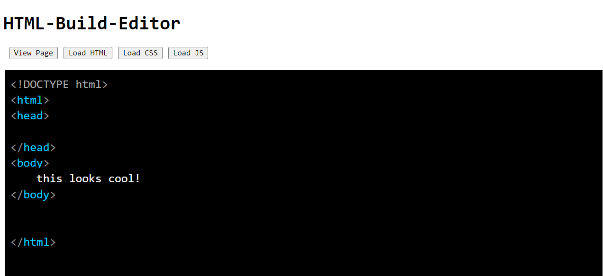

# HTML-Build-Editor
Editor and viewer for the HTML-Build BIM concept. I tried to keep to HTML, CSS and JS, but ended up with a tiny bit of PHP too. Thats ok for the editor as you need to spin up a server for it anyway, but it shouldn't be used in the HTML-IFC files.

## AIM
* demonstrate that it is easy to combine the HTML concepts
* that it makes it easy to edit
* that we cna use it to develop the interfaces and guidance we need in BIM
* that it can help us learn from BIM

## Approach
Really happy with the prism js library, it provides just the kind of code interface I was hoping for. It would be really cool to get the same colours in the css view for the viewer ....
